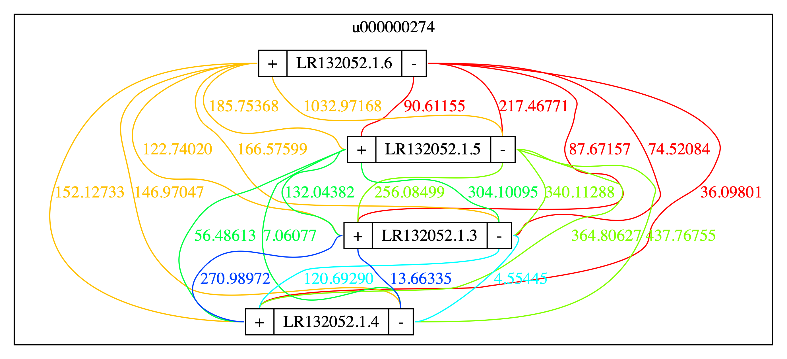

# satool
satool is a tool for managing SAT format. 

## Dependencies
1. zlib

## Third parties
1. [graphviz](https://www.graphviz.org/download/)

## Installation

Please use the following code to install satool:

```
git clone https://github.com/dfguan/satool.git
cd satool/src && make
```

## Usage
### Convert SAT to AGP
Given a **sat** file, convert it into AGP format
```
bin/satool agp $sat > t.agp
```

### Visualize a scaffold 
Given a scaffold name **scf** and **sat**, visualize it

```
bin/satool vis -s $scf $sat > t.dot
dot -Tpng -o t.png t.dot 
```



